# Objective
Install and configure Metasploitable through VirtualBox

# Useful Links
* [https://www.virtualbox.org/wiki/Downloads](https://www.virtualbox.org/wiki/Downloads)
* [https://sourceforge.net/projects/metasploitable/](https://sourceforge.net/projects/metasploitable/)

# Oracle VM VirtualBox
Before installing Metasploitable, it is necessary to install a virtual machine manager. In this case, we have chosen to use Oracle VM VirtualBox.

Go to the following address: [https://www.virtualbox.org/wiki/Downloads](https://www.virtualbox.org/wiki/Downloads). Download the installer for the latest version available for Windows (currently it is `7.0.20`). After installing the software, we should see the main screen:

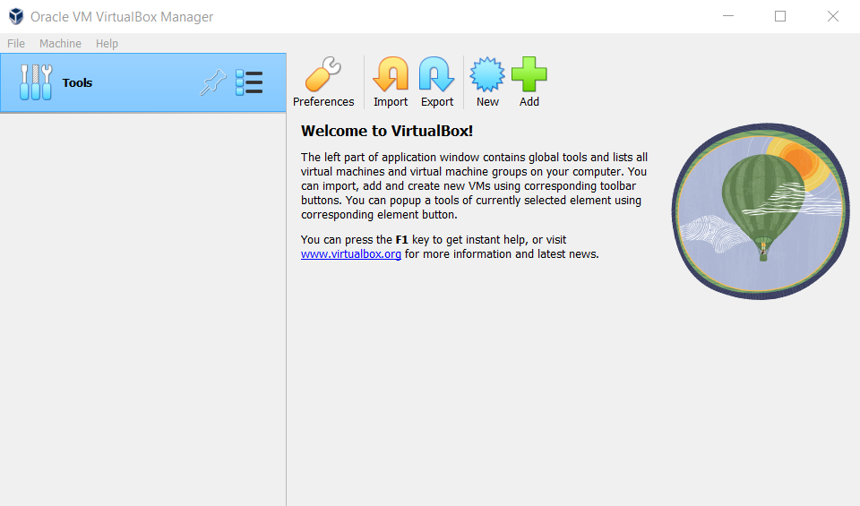

# Metasploitable
We can download Metasploitable from the following address: [https://sourceforge.net/projects/metasploitable/](https://sourceforge.net/projects/metasploitable/) (the file is about 1 GB):

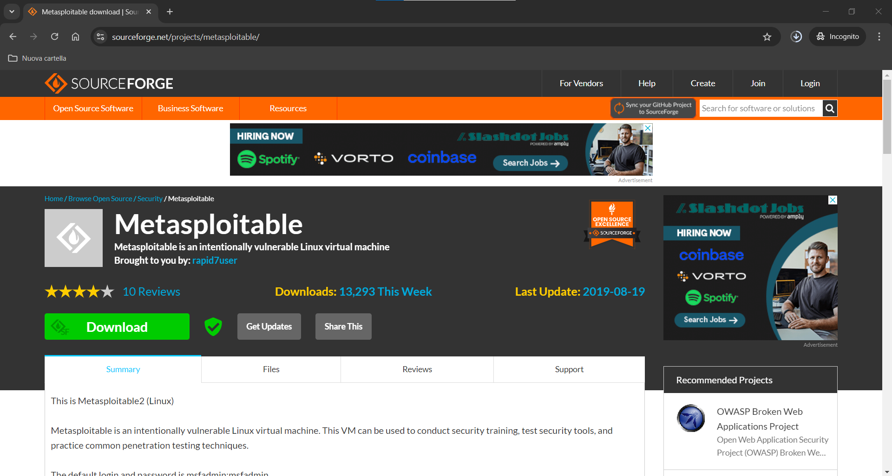

We saved the file in this directory:

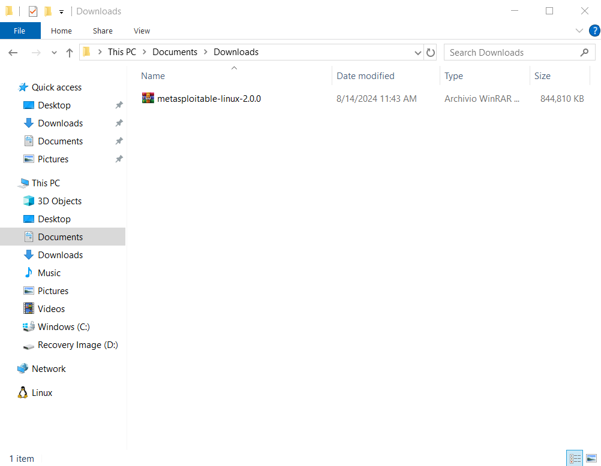

Extract the file:

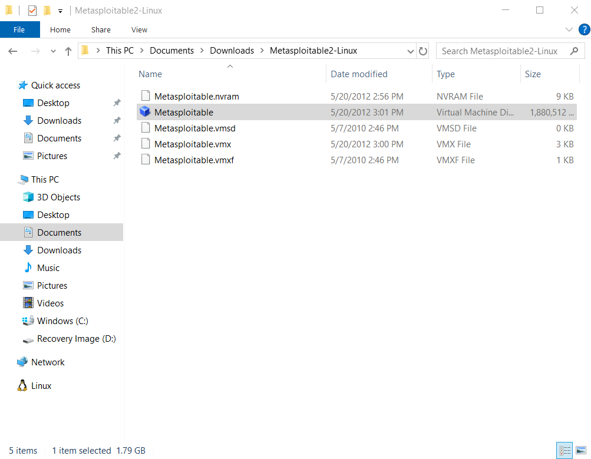

Now that we have downloaded Metasploitable, we can add it to VirtualBox for use. Open VirtualBox:

Click on `New`:

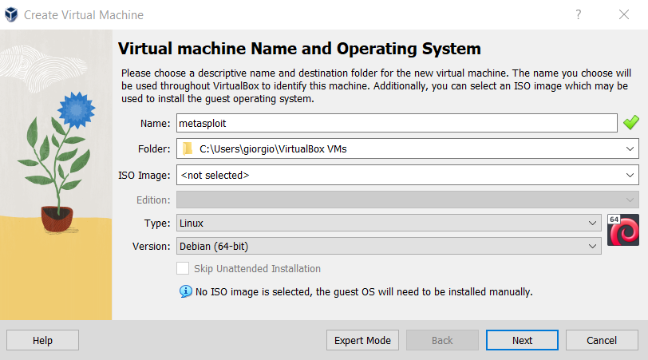

Assign a name to the VM you want to create, and select `Linux:Debian64` as the OS. In this way, we have created a VM on VirtualBox:

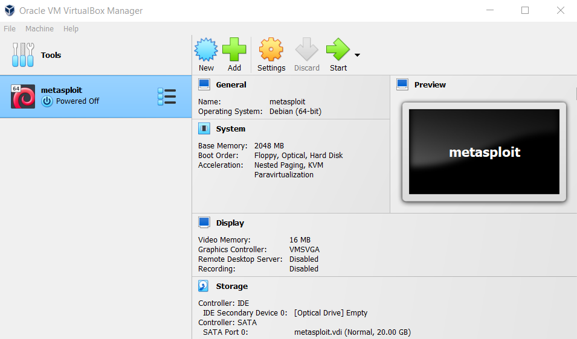

Now we can associate this VM with the Metasploitable file we downloaded. To do this, select the VM and click on `Settings`. Then select `Storage`. Here, select the default file `metasploit.vdi` under the `SATA` section. At this point, select `Choose a disk file`:

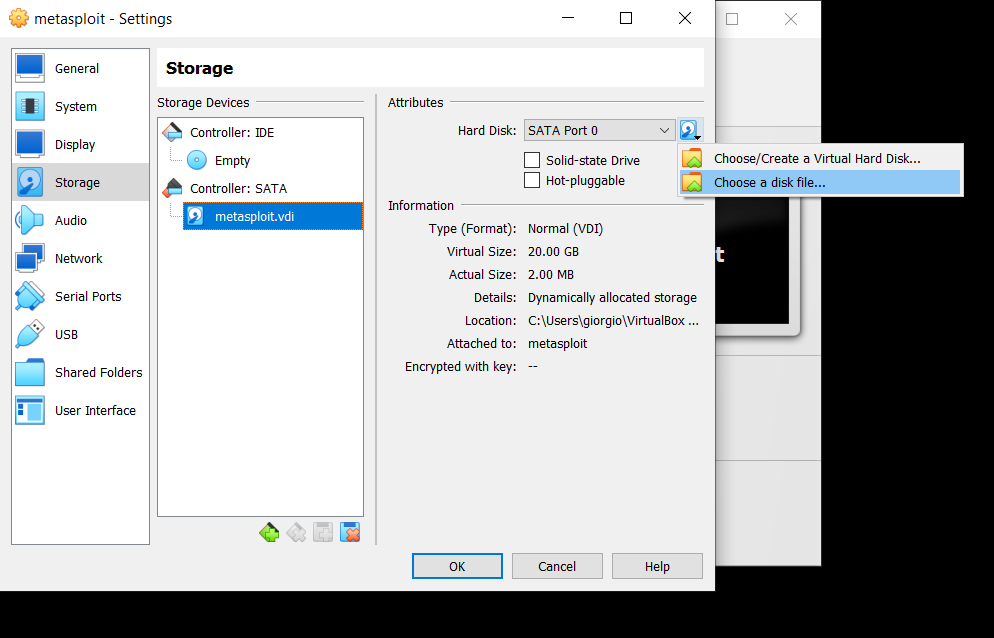

Select the `.vdmk` file:

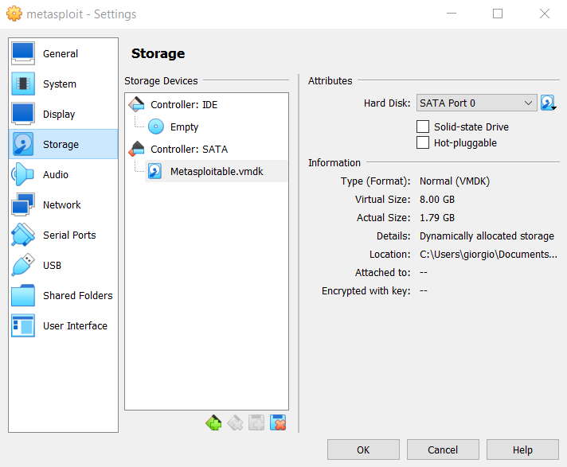

# Configuring Metasploitable
To use Metasploitable, select the VM on VirtualBox and click on `Run`. VirtualBox opens the Metasploitable shell. Upon access, you will be asked for credentials, which are displayed on the screen (`msfadmin:msfadmin`):

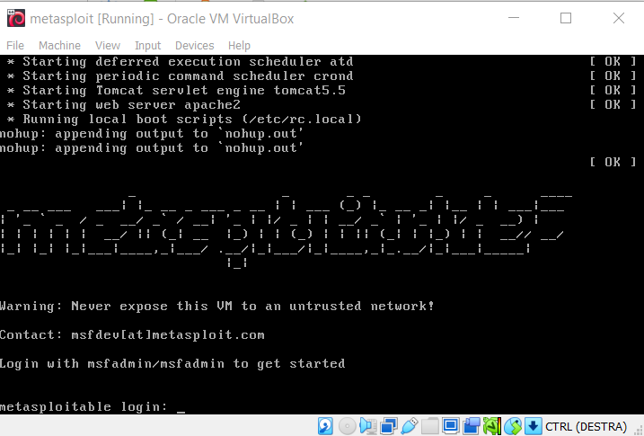

By entering the credentials, we finally arrive at the Metasploitable shell:

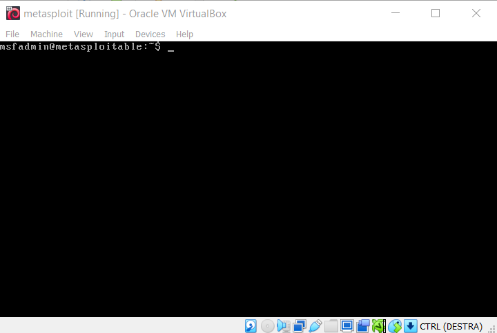

Using the `ifconfig` command, we can read the IP of the VM, which is `10.0.2.15`:

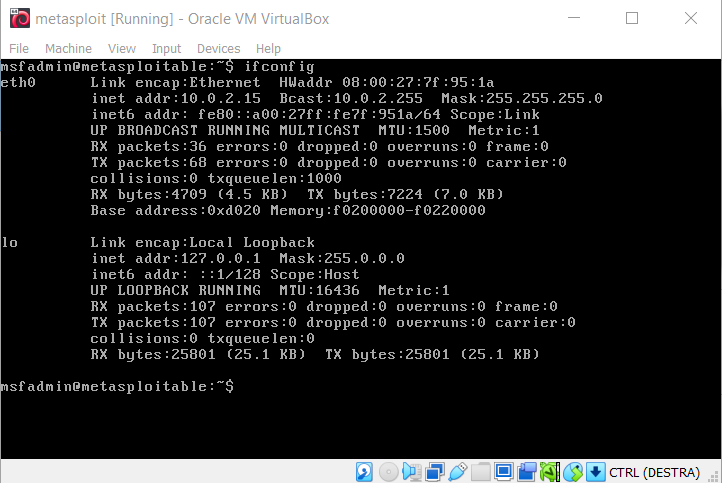

Trying to ping this IP from the Windows shell returns no results:

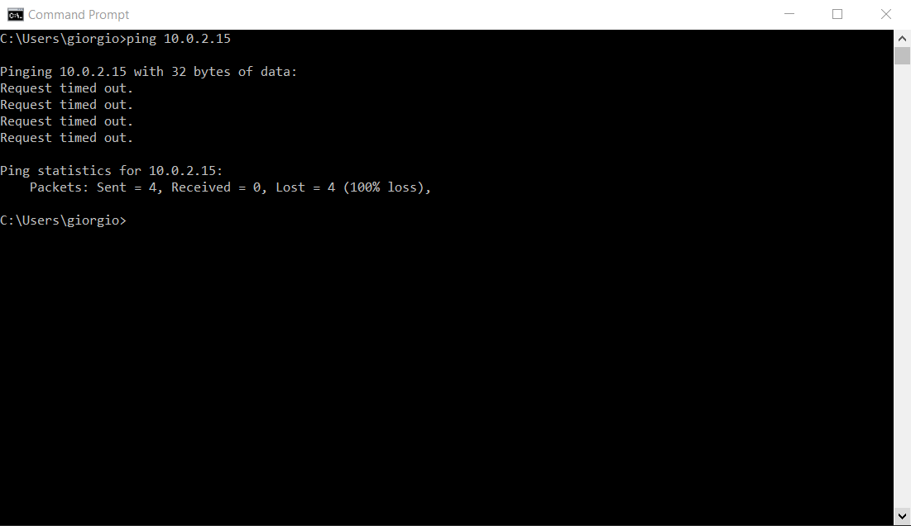

This happens because the VM is not yet configured in Bridged mode. To configure it, close the shell and return to the VM settings in the `Network` section:

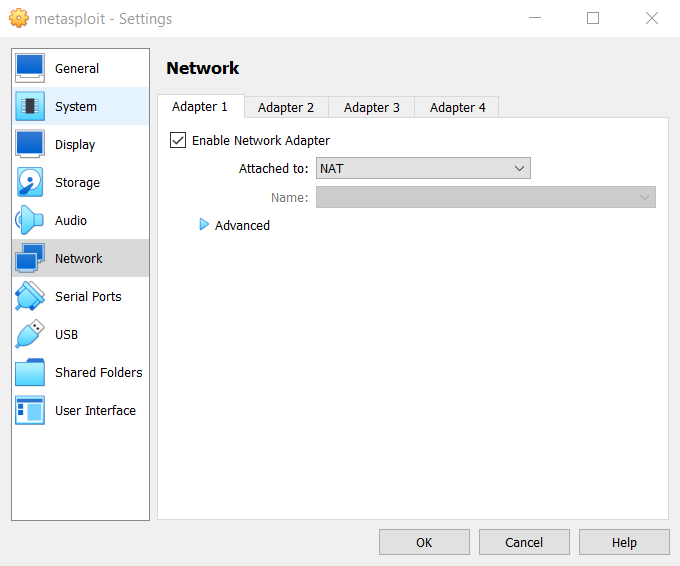

Here, we need to set the settings like this, selecting the same network interface we use on Windows:

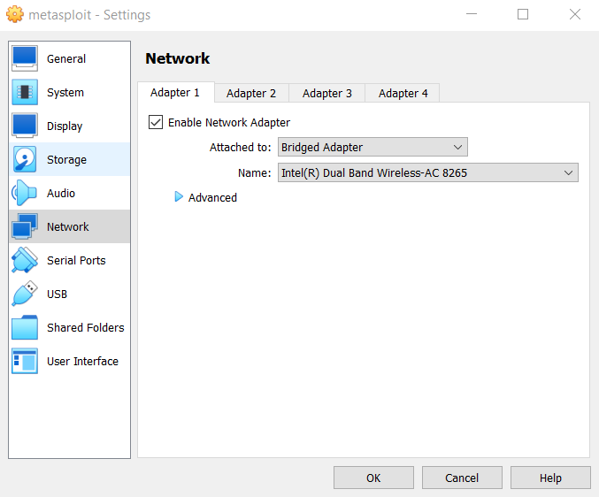

If we now reopen the VM, we can see that the IP has changed, and it is now `192.168.1.227`:

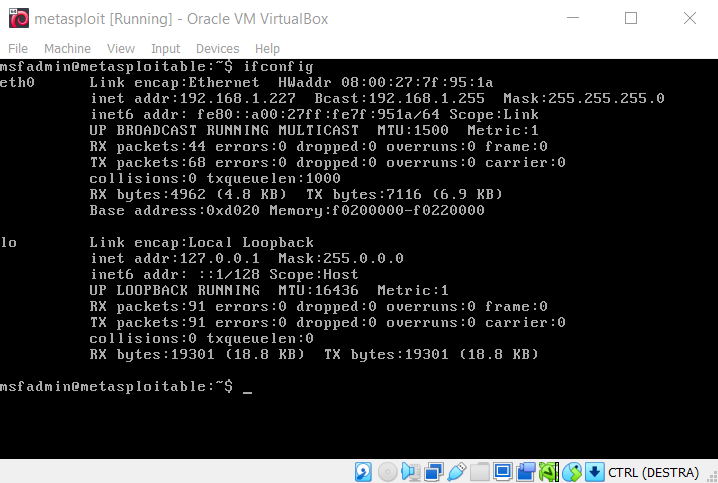

In this way, we can successfully ping Metasploitable from Windows:

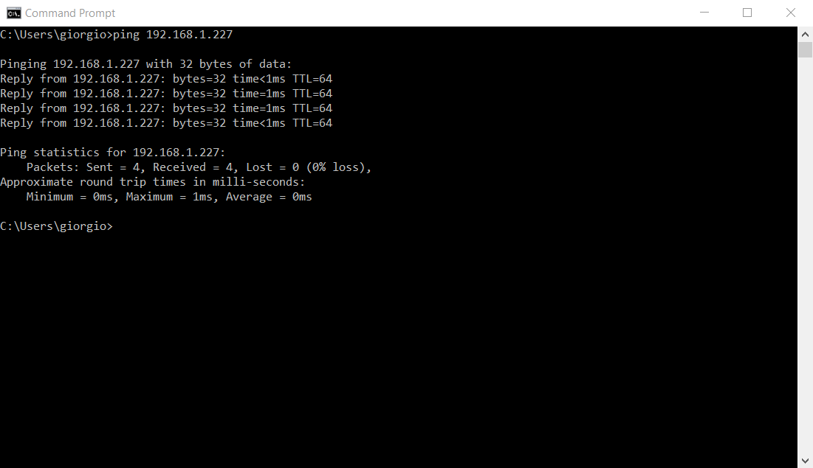