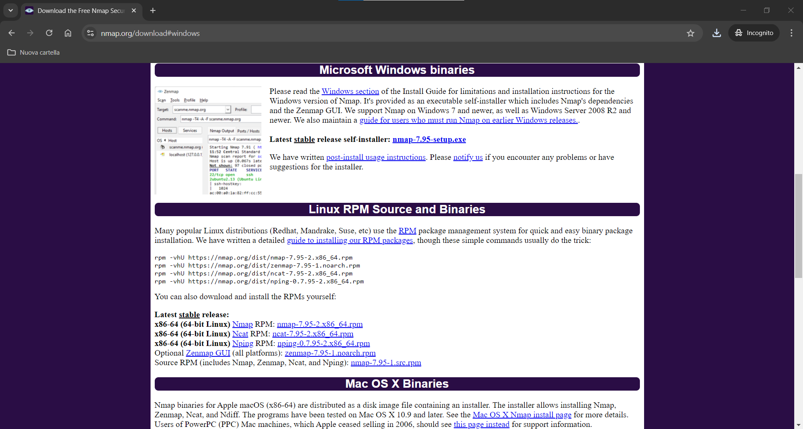
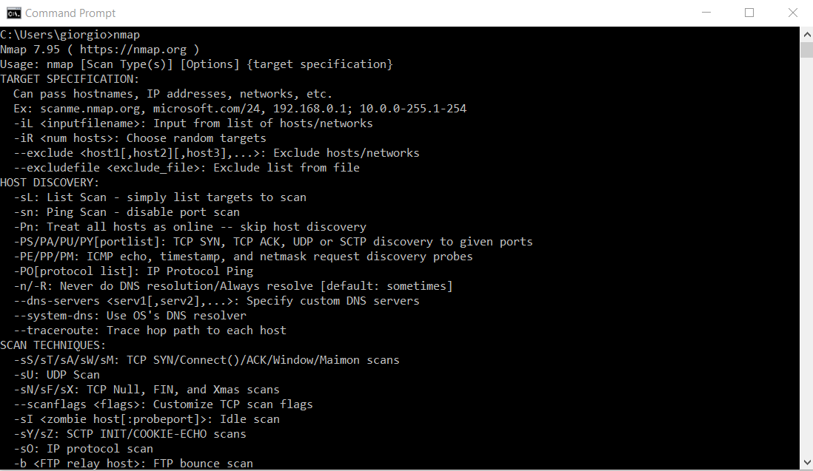
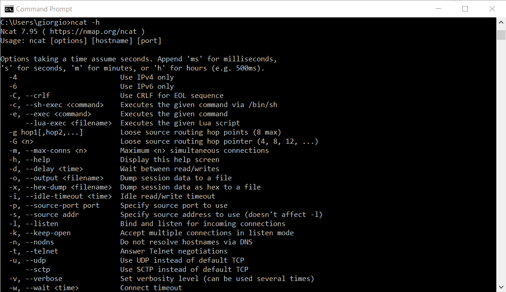

# Objective
Install Nmap to execute `nmap` and `ncat` commands from the Windows shell

# Main
In this section, we will see how to install Netcat on Windows. To do this, it is necessary to install Nmap. We go to the official [Nmap website](https://nmap.org/download):

Download the installer for the latest version for Windows (currently it is `7.92`). Then proceed with the installation. Once installed, we should be able to execute the following commands from the shell:

