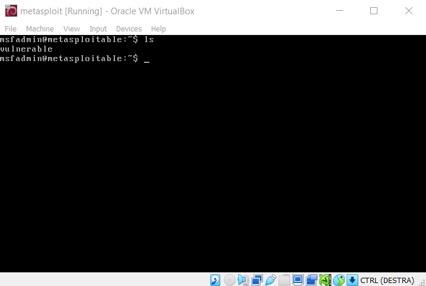

# metasploitable

* This project aims to demonstrate how to open a remote shell through `SSH`, `FTP` and `Netcat`
* This project was done on Windows

To execute `Netcat` commands on Windows, it is necessary to install `Nmap`, and it is shown in  [/main/Nmap installation](https://github.com/enricomaiolo/metasploitable/tree/main/Nmap%20installation).

To test these functionalities, Metasploitable was installed, which allows for a vulnerable VM. Additionally, Metasploitable is free.

We opened remote shells by connecting 3 devices:
* 2 physical machines with Windows OS on the same local network
* 1 VM with Linux OS (Metasploitable)

The remote shells that were opened were the following:
* from Metasploitable to Windows via `SSH` e `FTP`
* from Metasploitable to Windows via `Netcat`
* from Windows to Metasploitable via `Netcat`
* from Windows to Windows via `Netcat`

To open a shell of the type:
* from Windows to Metasploitable via `SSH` e `FTP`

it would be necessary to open the `SSH` and `FTP` ports on the physical machine, but this was not done. Conversely, it is not necessary to open ports to establish a connection via `Netcat`.

When a remote shell is opened, it is possible to navigate through the target's directories. The directories of the 3 devices are as follows:

* Physical machine 1

* Physical machine 2

* Virtual machine (it only has one directory called `vulnerable`)

There are two kind of remote shells:
* Bind shell have the listener running on the target (we used that via `SSH` and `FTP`)
* Reverse shell have the listener running on the user (we used that via `Netcat`)