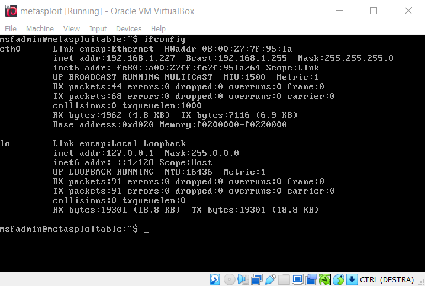

We demonstrate how to open a remote shell through `SSH` and `FTP`, allowing us to navigate the directories of Metasploitable using the physical machine.

To do this, we need the IP address of Metasploitable:

The address is `192.168.1.227`.

We can establish these types of connections because Metasploitable has the ports associated with these protocols open, as seen by performing a scan with Nmap:

To access via `SSH`, we execute the following commands:

To access via `FTP`, we execute the following commands:

In both cases, we are prompted for Metasploitable credentials, which are `msfadmin:msfadmin`.

In both cases, we are able to access the directories of Metasploitable. For example, by executing the `ls` command, we see the `vulnerable` directory.